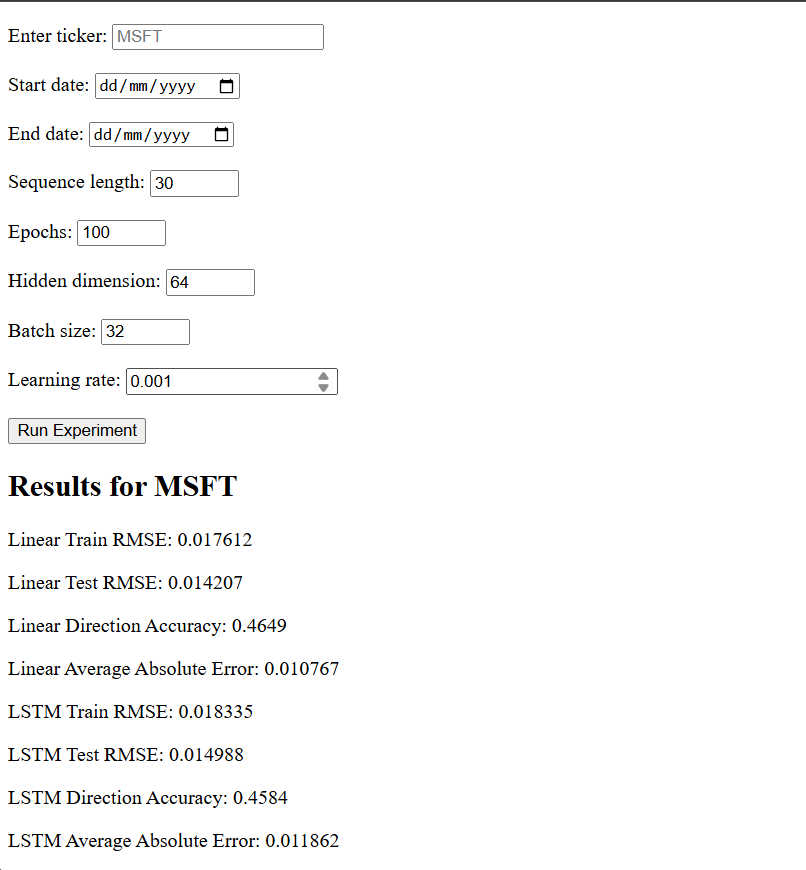

# Stock Returns Prediction using LSTM and Linear Regression

## Overview

This project predicts next-day stock returns using historical market data and technical indicators, and produces metrics to evaluate the accuracy of each model.

The application is built with Python, PyTorch and Flask, allowing users to enter any stock ticker and compare the performance of an LSTM neural network against a Linear Regression baseline.

## Features

- Downloads and caches historical stock market data using yfinance, automatically updating local datasets with newly available trading data to minimise repeated downloads.
- Caches trained LSTM models based on ticker symbol, date range, and model configuration, allowing previously trained models to be reused without retraining.
- Generate technical indicators automatically
- LSTM prediction model
- Linear Regression baseline
- Compare multiple evaluation metrics
- Flask web interface
- Plots of predictions

## Models

### Linear Regression
- Fast baseline
- Easy to interpret

### LSTM
- Learns temporal patterns
- Uses sliding window sequences

## Evaluation

Models are compared using:

- RMSE
- Mean Absolute Error
- Directional Accuracy

## Technologies

- Python
- PyTorch
- scikit-learn
- Flask
- pandas
- NumPy
- matplotlib
- yfinance

## Usage

python app.py

## Example

## Project Structure

project/
│
├── app.py
├── train.py
├── predict.py
├── evaluate.py
├── scaling_lstm.py
├── plots.py
├── main.py
├── models/
├── data/
├── saved_data/
├── saved_models/
├── templates/
└── README.md

## Future Improvements

- Transformer model
- Hyperparameter optimisation
- Model checkpoint saving
- Docker deployment
- Live predictions
- Feature selection using mutual information