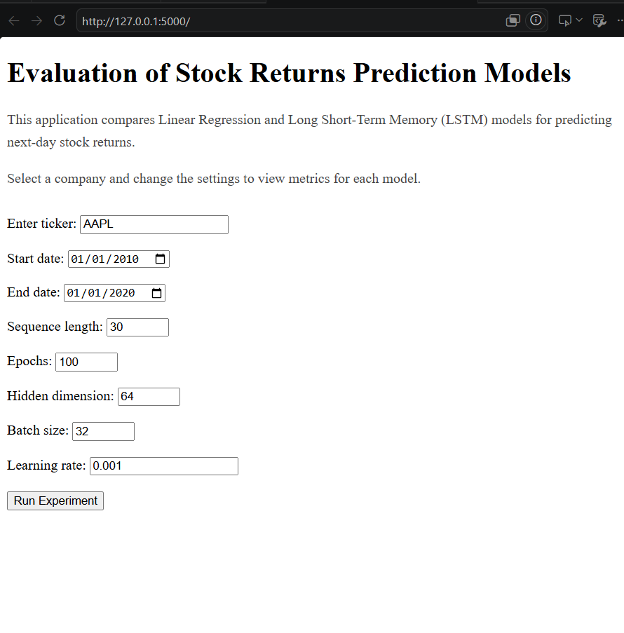
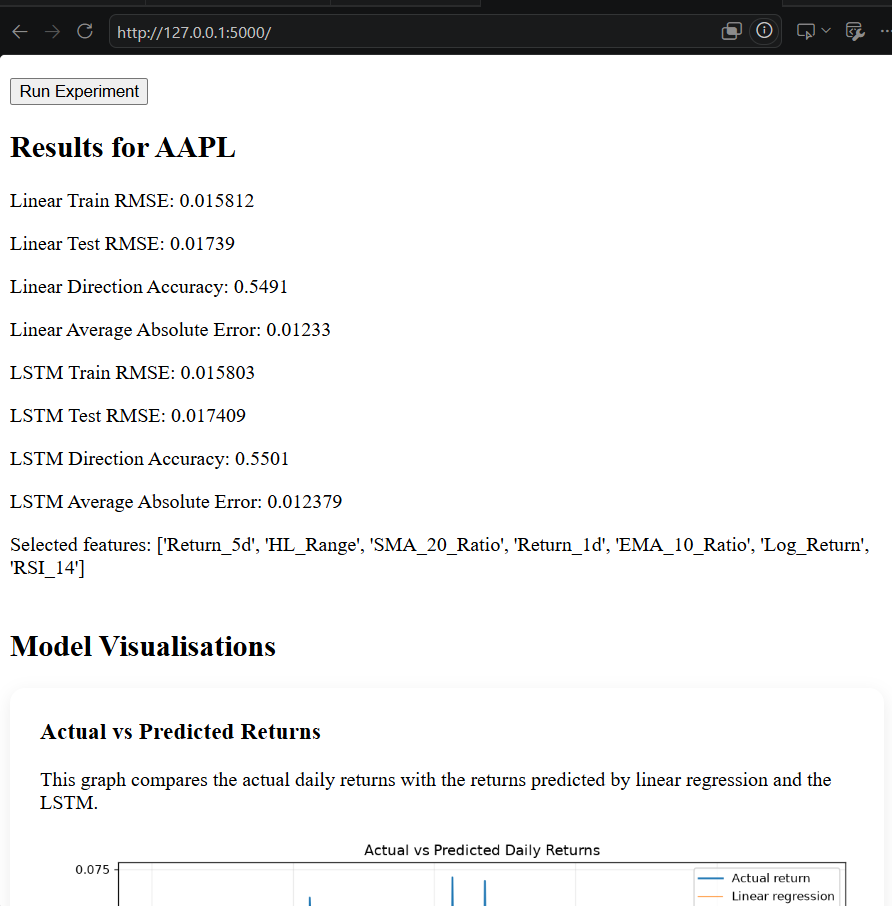
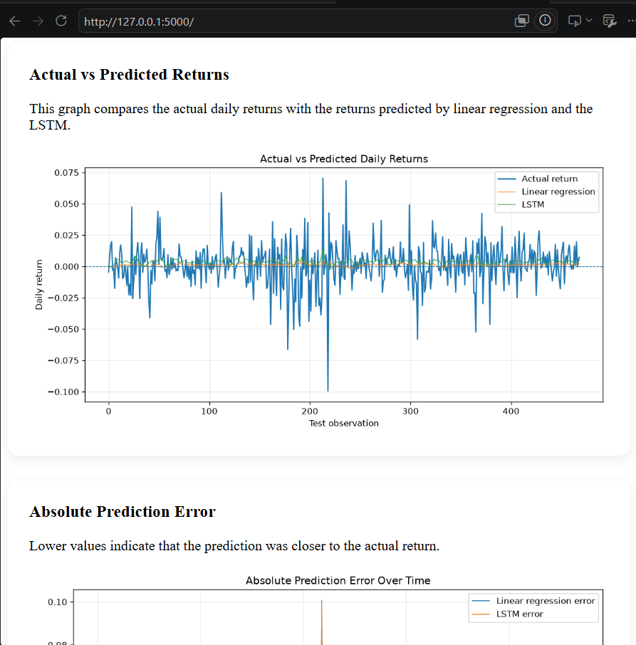
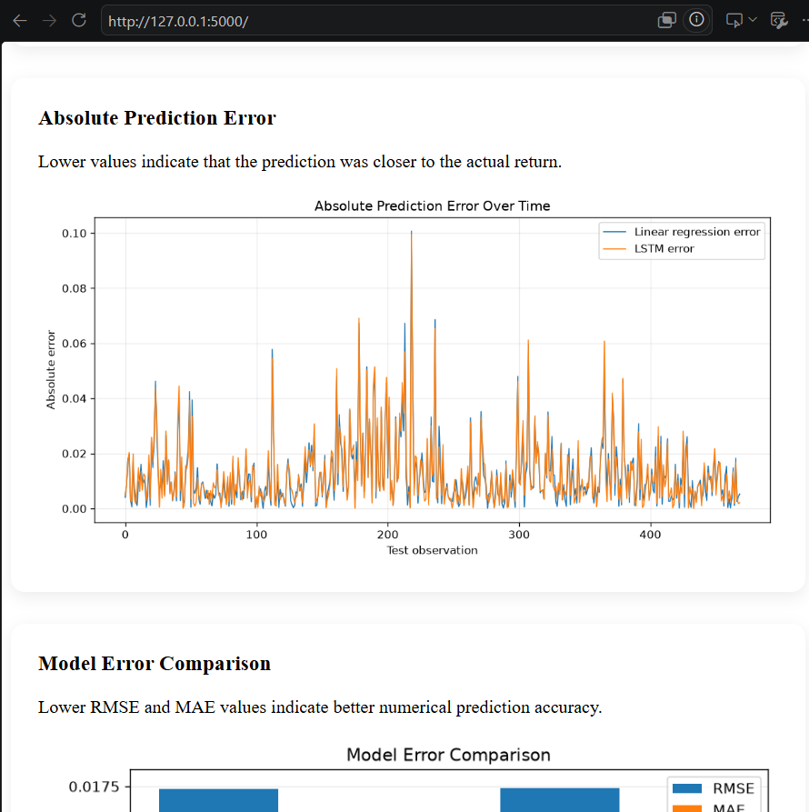
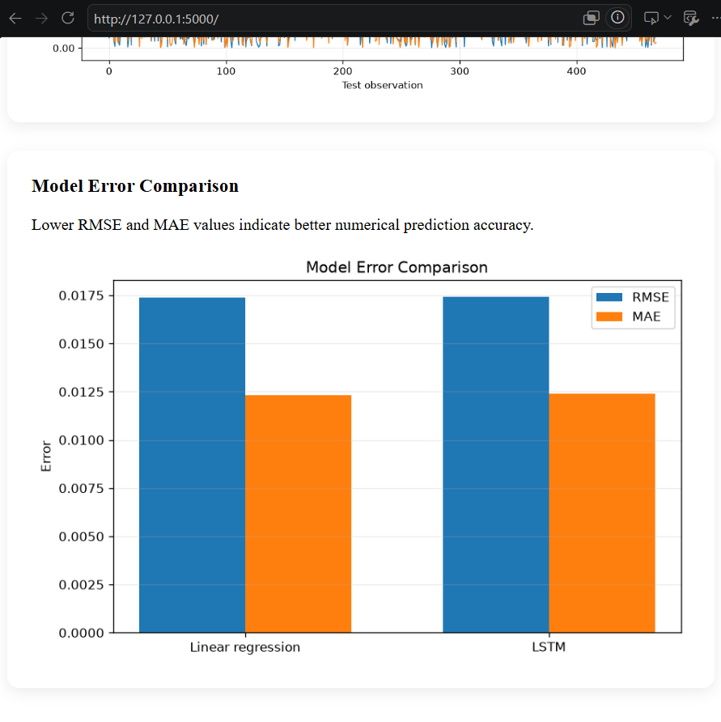
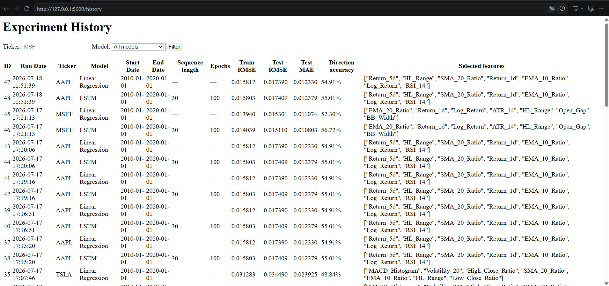

# Stock Returns Prediction using LSTM and Linear Regression

## Overview

This project compares a Long Short-Term Memory (LSTM) model against a Linear Regression baseline for predicting next-day stock returns.

The application downloads historical market data, engineers technical indicators and trains and evaluates both models to compare their predictive performance using multiple evaluation metrics.

## Project Workflow

Download Historical Stock Data
        │
        ▼
Feature Engineering
        │
        ▼
Feature Selection
        │
        ▼
Train Linear Regression
        │
        ▼
Train LSTM
        │
        ▼
Evaluate Models
        │
        ▼
Visualisations & SQLite Logging

## Features

- Downloads and caches historical stock market data using yfinance, automatically updating local datasets with newly available trading data to minimise repeated downloads
- Engineers technical indicators including RSI, ATR, MACD and volatility
- Performs Mutual Information feature selection
- Caches trained LSTM models based on ticker symbol, date range, and model configuration, allowing previously trained models to be reused without retraining
- Compares model performance using RMSE, MAE and Directional Accuracy
- Interactive Flask web interface
- Generates prediction, error and performance visualisations
- Error handling for invalid inputs and unavailable data
- Records experiment results in an SQLite database

## Engineering Highlights

- Modular architecture separating data processing, models, training, prediction and evaluation
- Automatic historical data caching and incremental updates
- Reusable saved models to avoid unnecessary retraining
- Experiment logging using SQLite
- Flask web interface for interactive model evaluation

## Engineered Features

### Price Action

- Open_Gap
- High_Close_Ratio
- Low_Close_Ratio
- HL_Range

### Returns

- Return_1d
- Return_5d
- Log_Return

### Trend Indicators

- SMA_10_Ratio
- SMA_20_Ratio
- EMA_10_Ratio
- EMA_20_Ratio
- MACD
- MACD_Histogram

### Volatility

- ATR_14
- Volatility_20
- BB_Width

### Volume

- Volume_Ratio_20
- Volume_Change
- OBV_Change


## Evaluation

Models are compared using:

- RMSE - average prediction error
- Mean Absolute Error - average absolute error
- Directional Accuracy - percentage of correctly predicted price movement direction

## Technologies

- Python
- PyTorch
- scikit-learn
- Flask
- pandas
- NumPy
- matplotlib
- yfinance
- SQLite


## Motivation
This project was developed to explore how deep learning models compare with traditional statistical methods for predicting short-term stock-returns.


## Installation

1. Clone the repository:

```bash
git clone https://github.com/lilyroberts-a/Stock_Prediction_LSTM.git
```

2. Navigate to the project directory:

```bash
cd Stock_Prediction_LSTM
```

3. (Optional but recommended) Create and activate a virtual environment:

Windows:

```bash
python -m venv .venv
.venv\Scripts\activate
```

macOS/Linux:

```bash
python3 -m venv .venv
source .venv/bin/activate
```

4. Install the required packages:

```bash
pip install -r requirements.txt
```

5. Run the application:

```bash
python app.py
```

or, to run the training script directly:

```bash
python main.py
```


## Example
### User Input

Ticker: AAPL

Training Period: 2015-01-01 → 2025-01-01

Sequence Length: 30

Epochs: 100

Hidden Dimension: 64



### Model Comparison


### Plots






### Experiment History




## Project Structure

Stock_Prediction_LSTM/
│
├── app.py
├── main.py
├── train.py
├── predict.py
├── scaling_lstm.py
├── evaluate.py
├── plots.py
├── database.py
│
├── data/
│   ├── features.py
│   └── sequences.py
│
├── models/
│   ├── lstm.py
│   └── linear_regression.py
│
├── templates/
├── saved_models/
├── saved_data/
├── images/
└── stock_models.db


## Future Improvements

- Model checkpoint saving
- Docker deployment
- Add Transformer model
- Add previous return baseline (eg. tomorrow's return = todays return)

